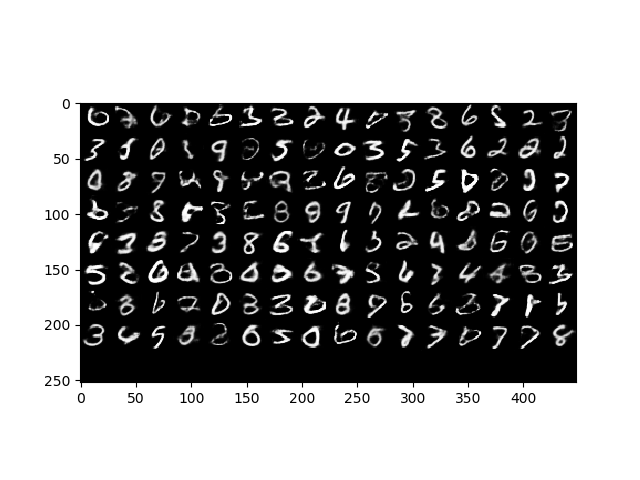
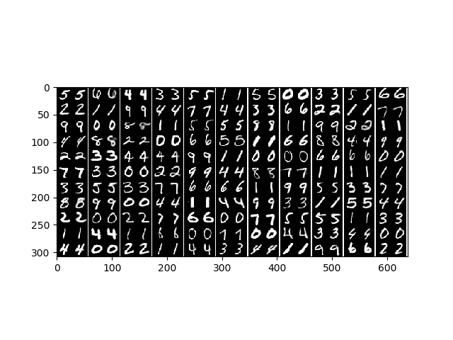

## Adversarial Autoencoder

An adversarial autoencoder object. For theoretical details please check the paper
available [**here**](https://arxiv.org/pdf/1511.05644.pdf).

**AdversarialAE.py** implements a unsupervised version of AAE and **GeneralAAE.py** implements all
types of supervision, i.e, unsupervised, supervised, and semi-supervised (still under construction).

To use the model, simply call the object as shown below.

**Getting the data:**
We start by downloading the MNIST dataset:

    from tensorflow.examples.tutorials.mnist import input_data
    mnist = input_data.read_data_sets('./mnist/', one_hot=True)

**Build the model, train/save or load:**

    # train and save the model
    aae.train(dataset=mnist, n_epoch=20, report_flag=False)
    aae.save('./AdversarialAE/saved_models/model.ckpt')

    # load the model
    aae.load('./AdversarialAE/saved_models/model.ckpt')

While training, use tensorboard visualization to monitor different parameters.
In tensorboard, undeer the **IMAGES** tab, find the progress of generation and reconstruction of images.

**Testing the generator:**
  
    plt.imshow(aae.generator_viewer(128), cmap='gray')

**Testing the dimensionality reduction:**
  
    # get the images
    images, labels = mnist.test.next_batch(128)
    images = images.reshape((-1,28,28))
    image = images[0,:,:]
                    
    # test the dimensionality reduction
    z = aae.reduce_dimension(images)

**Testing the reconstruction:**

    plt.figure()
    plt.imshow(np.hstack((image.reshape(28,28), 
                        aae.reconstruct(image).reshape(28,28)
                        )), cmap='gray')
    

    plt.imshow(aae.reconstructor_viewer(images), cmap='gray')

   
    
**Testing the 2D-visualizations:**
Let us now test the 2D viisualization through AAEs:
    
    # build the 2 dimensional model
    aae2d = AAE(reduced_dim=2) 

    # train and save the model
    aae2d.train(dataset=mnist, n_epoch=20, report_flag=False)
    aae2d.save('./AdversarialAE/saved_models/model2d.ckpt')

    # load the model
    aae2d.load('./AdversarialAE/saved_models/model2d.ckpt')
    
    
**Displaying the scatter plot of 2d latent features:**

    # get the images
    images, labels = mnist.train.next_batch(1000)
    images = images.reshape((-1,28,28))
                    
    # the scatter plot of 2d latent features
    aae2d.visualization_2d(images, labels)

**Displaying the spectrum of the generated images:**

    aae2d.spectum_2d(25)

